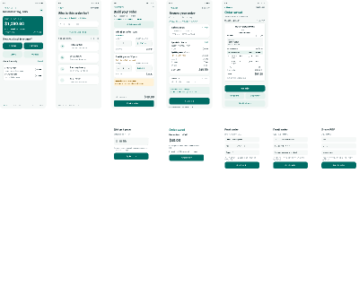

# Original Figma design archive

Current project direction: [responsive web application](../WEB_APP_SPEC.md). [Back to documentation index](../README.md).

Original .fig, ten screen PNGs and the paper reference are archived. This index preserves source provenance; [DESIGN_REFERENCE.md](../DESIGN_REFERENCE.md) explains current use.

Archived 2026-09-27 from the file supplied by the project owner. This supersedes earlier notes saying no editable design export was backed up.

## Files

- [Original editable export](source/inventory-sales-mobile-prototype.fig): unchanged bytes; only the repository filename was simplified.
- [Embedded preview](images/figma-embedded-preview.png): extracted unchanged from thumbnail.png inside the export.
- [Export metadata](source/export-metadata.json): original meta.json, extracted unchanged.
- [Integrity manifest](manifest.json): file sizes, SHA-256 hashes and archive contents.
- [Written design reference](../DESIGN_REFERENCE.md): colors, screen IDs, flow and print requirements.

## Preview

This is the actual embedded preview, 400 × 328 pixels, not a newly generated mockup. It shows five main mobile screens across the top, smaller dialog views below, and four blank frames along the bottom. Text is too small for detailed inspection. Do not enlarge it and treat the result as a full-resolution screen export.

## Provenance and validation

Original filename: Inventory & Sales — Mobile Prototype.fig.

Export metadata timestamp: 2026-09-27T06:54:56.308Z (00:54:56 in America/El_Salvador).

Original file size: 151,467 bytes.

SHA-256: `661adbf7e11814ff23ce54f8569d425527cf5ad878522112734e189696bf89c6`.

The ZIP container integrity check passed. Its entries are canvas.fig (138,428 bytes), thumbnail.png (11,983 bytes), meta.json (352 bytes), and an empty images/ directory. No separate embedded raster assets were present beyond the thumbnail. Vector/text design data remains inside canvas.fig, preserved within the original export. Internal canvas data was not decoded or modified.

The preview was visually inspected. The file has not been reimported into Figma for a restore test; therefore this record confirms byte preservation and container integrity, not successful reimport or validation of every component/prototype interaction.

## Restore and study procedure

1. Download the original .fig using GitHub's raw/download action; do not save the GitHub HTML page as a .fig file.
2. Compare its size and SHA-256 with manifest.json. On Windows PowerShell, use `Get-FileHash .\inventory-sales-mobile-prototype.fig -Algorithm SHA256`.
3. Import the local .fig into Figma using its file-import interface. Use a separate copy so the existing design is preserved.
4. Check pages, main frames, components, fonts and prototype links in the imported file. Record the actual result and date in PROGRESS.md.
5. Compare the imported file with the already archived [screen exports](screens/README.md). If new exports are produced, preserve their provenance and node IDs.

Preserving a Figma file does not preserve account permissions, guarantee remote component availability, or make its mock buttons into functional software.

## Additional archived visual references

- [Ten readable screen exports and previews](screens/README.md), with [checksums](screens/manifest.json).
- [Original paper photograph](reference/paper-form.png), with [provenance](reference/README.md) and [checksum](reference/manifest.json).
- [Order/invoice print requirements](../PRINT_PREVIEW_SPEC.md). The detailed BCS invoice photograph guides both outputs; the simplified Figma preview is not final.

These separately supplied assets are outside the original .fig container. No synthetic screenshots are represented as original exports. Live Figma access and successful reimport still require their own verification.
