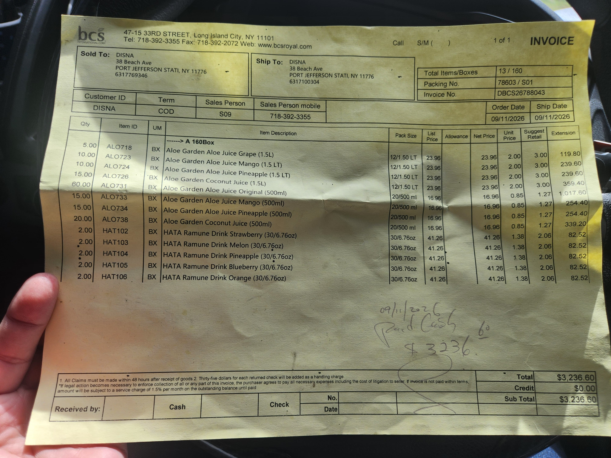

# Order and invoice paper reference

Owner-supplied image(7).png, archived unchanged on 2026-09-27 after workspace recovery. See [integrity manifest](manifest.json).

This is a populated BCS invoice with DISNA shown as the customer. It is DIFFERENT from the earlier blank DISNA order/payment pad. The owner selected this latest image as the print-preview reference for both orders and invoices. See [current print specification](../../PRINT_PREVIEW_SPEC.md).

Observed structure: supplier header, Sold To / Ship To boxes, document identifiers and dates, customer/terms/salesperson row, detailed product grid, totals, receipt/payment footer. Preserve the layout concept using the app business and transaction data; do not hard-code the photograph's branding, contact details, transaction values, handwriting or legal terms. The photograph is an archival reference, not a print background.

Image integrity and appearance were inspected. This archive does not implement a PDF renderer or print preview.
