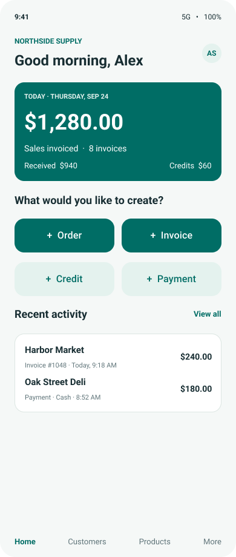
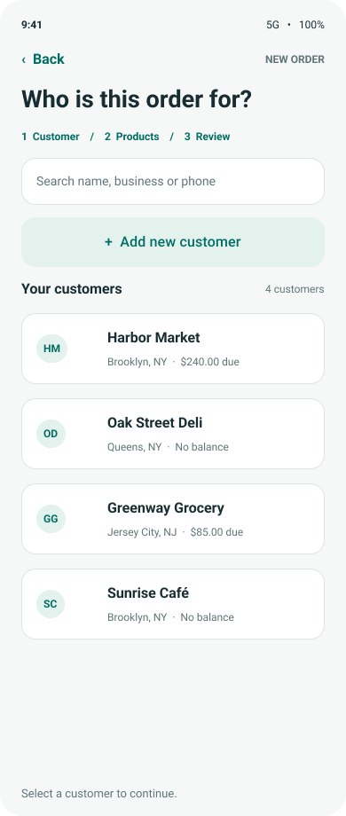
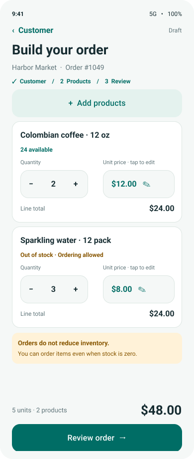
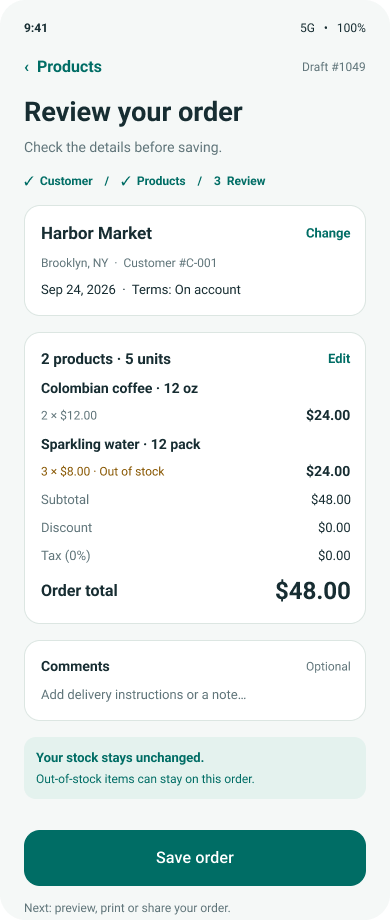
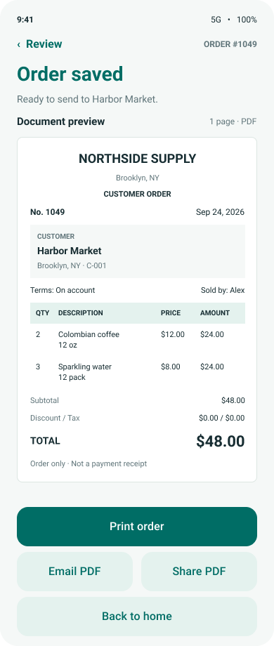
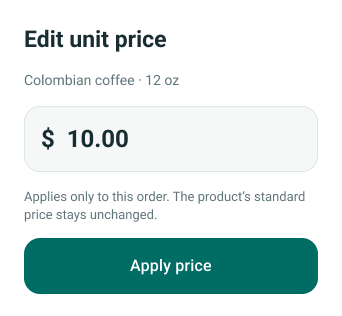
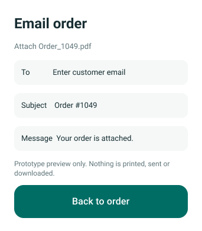
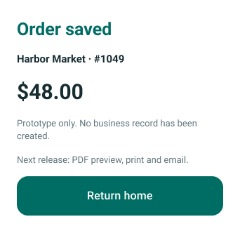
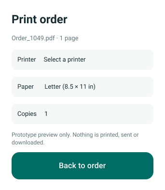
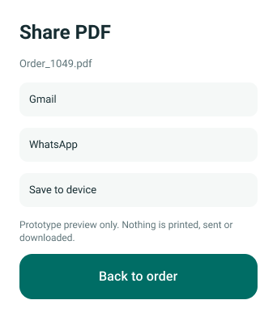

# Screen export gallery

Owner-supplied PNG exports archived on 2026-09-27. All ten images were visually inspected and their PNG integrity checked. Original bytes are preserved; repository filenames are normalized. Original names, dimensions, sizes and SHA-256 checksums are in [manifest.json](manifest.json).

These are static prototype references, not evidence of implemented software. Sample names, dates, amounts and order numbers are demonstration data. Five main screens are 390 × 920 pixels; the five dialogs have their own dimensions. No resampling or generated replacement images were used.

## Inventory

| Image | Dimensions | Purpose |
| --- | --- | --- |
| [01 Home.png](01-home.png) | 390 × 920 | Home dashboard with four transaction actions, sample daily totals and bottom navigation. |
| [02 Choose customer.png](02-choose-customer.png) | 390 × 920 | Customer search, creation action and customer balance cards. |
| [03 Build order.png](03-build-order.png) | 390 × 920 | Two product cards, quantity/price controls, out-of-stock warning; orders do not deduct stock. |
| [04 Review order.png](04-review-order.png) | 390 × 920 | Customer, terms, items, totals, comments and save action. |
| [05 Order saved · Document preview.png](05-order-saved-document-preview.png) | 390 × 920 | Primary saved-order screen with simplified document preview, print/email/share actions. This is not the final paper-reference template. |
| [Edit price · Overlay.png](06-edit-price-overlay.png) | 342 × 316 | Transaction-only unit-price edit. The USD 10 value is a separate mock state; other exports still show USD 12. |
| [Email order · Action preview.png](07-email-order-action-preview.png) | 342 × 392 | Email draft preview with PDF attachment label; no email was sent. |
| [Order saved · Demo confirmation.png](08-order-saved-demo-confirmation.png) | 342 × 329 | Earlier demo confirmation, retained for history. Use screen 05 for the main saved-order flow. |
| [Print order · Action preview.png](09-print-order-action-preview.png) | 342 × 392 | Print dialog mockup with Letter paper and copies; no printer compatibility is established. |
| [Share PDF · Action preview.png](10-share-pdf-action-preview.png) | 342 × 392 | Share targets mockup; no PDF was saved or shared. |

## Visual references

### 01 Home.png

Home dashboard with four transaction actions, sample daily totals and bottom navigation.

### 02 Choose customer.png

Customer search, creation action and customer balance cards.

### 03 Build order.png

Two product cards, quantity/price controls, out-of-stock warning; orders do not deduct stock.

### 04 Review order.png

Customer, terms, items, totals, comments and save action.

### 05 Order saved · Document preview.png

Primary saved-order screen with simplified document preview, print/email/share actions. This is not the final paper-reference template.

### Edit price · Overlay.png

Transaction-only unit-price edit. The USD 10 value is a separate mock state; other exports still show USD 12.

### Email order · Action preview.png

Email draft preview with PDF attachment label; no email was sent.

### Order saved · Demo confirmation.png

Earlier demo confirmation, retained for history. Use screen 05 for the main saved-order flow.

### Print order · Action preview.png

Print dialog mockup with Letter paper and copies; no printer compatibility is established.

### Share PDF · Action preview.png

Share targets mockup; no PDF was saved or shared.

## Handoff implications

The existing order journey and overlays can now be inspected without calling Figma. The original editable .fig remains in ../source/. Future invoice, credit, payment, reporting, inventory-management and admin screens are still required; these ten exports do not cover the full app scope. The original paper-form photograph remains missing from the repository.
