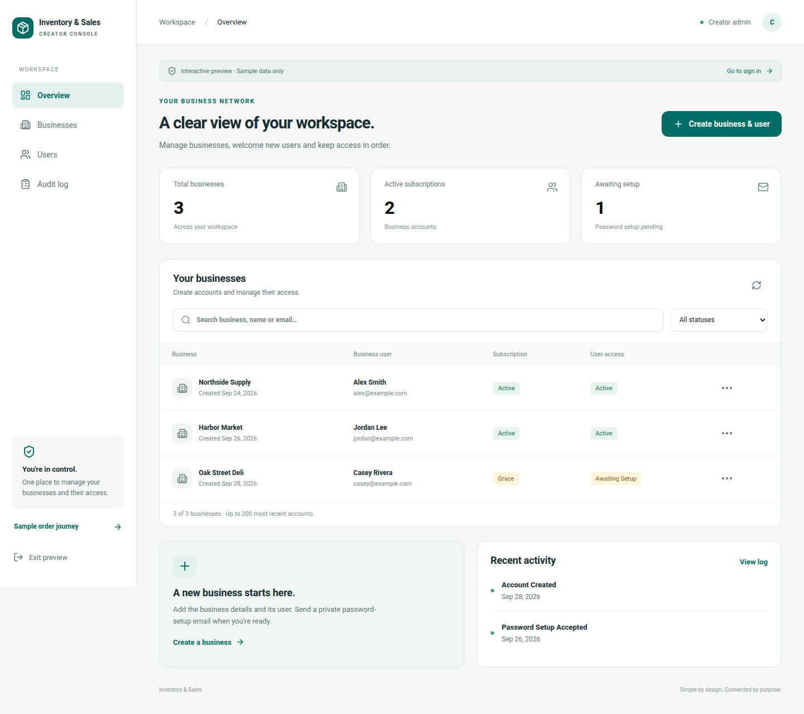
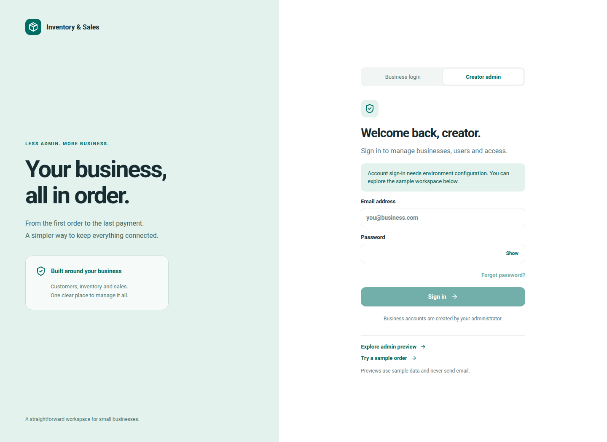

# First web implementation — visual evidence

Captured from the actual React application in Chromium at 1440 × 1050 and 390 × 844 viewports. All data is synthetic. These screenshots are implementation evidence, distinct from the original Figma archive. The preview is not a deployed production service.

## Creator admin dashboard

[Phone dashboard](screens/admin-phone.png)

## Login

[Phone login](screens/login-phone.png)

## Sample order

[Phone order preview](screens/order-phone.png)

The sample document is explicitly unfinished; the original paper-reference PDF renderer belongs to M4. See [build/setup instructions](../BUILD_SETUP.md) and [progress](../PROGRESS.md).
